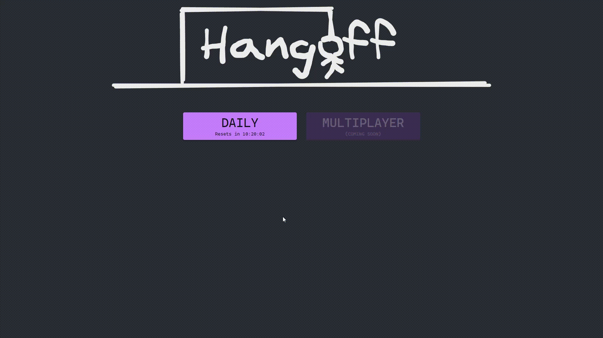

<div align="center">
  <h1>Hangoff</h1>
  <p>
    <strong>Your good old hangman game, with a new word each day, in the browser!</strong>
    <br/>
    Multiplayer mode - coming soon
  </p>
  <h2>

[](https://github.com/benny-n/hangoff/actions/workflows/ci.yml)

[](https://hangoff.vercel.app)
</h2>

</p>


</div>

# Development In Docker

```bash
$ docker build -t hangoff:app-dev -f hangoff-app/dev.Dockerfile ./hangoff-app
```

Build the server image using the following command

```bash
$ docker build -t hangoff:server-dev -f hangoff-server/dev.Dockerfile ./hangoff-server
```

Run development containers using the command shown below.
*Note that development environment requires local dependencies has to be installed*
```bash
$ docker-compose -f dev.docker-compose.yml up -d
```

# Production In Docker

Build the app image using the following command

```bash
$ docker build -t hangoff:app -f hangoff-app/Dockerfile ./hangoff-app
```

Build the server image using the following command

```bash
$ docker build -t hangoff:server -f hangoff-serverDockerfile ./hangoff-server
```

Run production containers using the command shown below.

```bash
$ docker-compose up -d
```

## Environment Variables

| Variable | Default Value |
| ------ | ------ |
| PORT | 5545 |
| VOCABULARY_URI |  |

**Please Make Sure to run DB container as well and also the netwrok is the same docker network**


